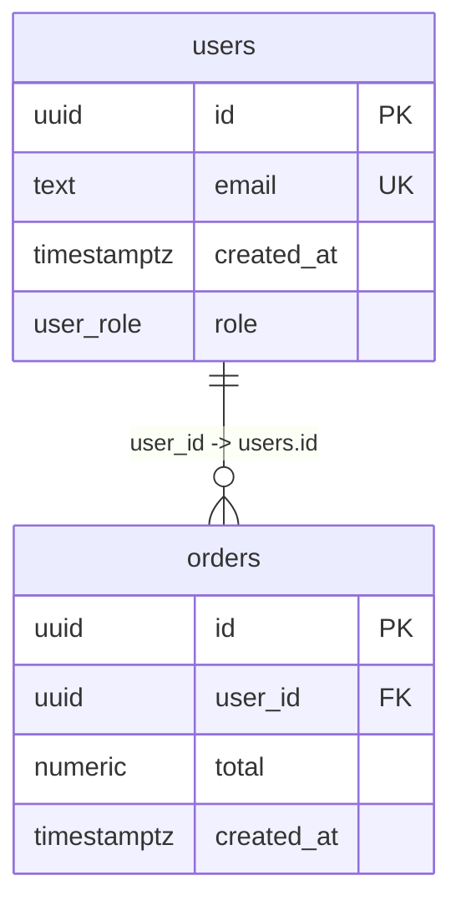

# 🏗️ Repository Analyzer Architecture Documentation

## 📋 System Overview

The Repository Analyzer is a **production-ready Golang application** designed to help onboard new developers by providing comprehensive codebase analysis through advanced LLM integration. The system transforms complex repositories into clear, actionable insights through a sophisticated analysis pipeline.

### 🎯 Core Purpose
Help new developers understand unfamiliar codebases by providing:
- **Purpose Analysis**: Why this repository exists
- **Architecture Overview**: Simplified architectural explanation  
- **Data Models**: Key structures and their relationships
- **External Services**: APIs, databases, and integrations
- **Database Schema**: Visual ERD of database relationships
- **Service Relationships**: Microservice dependency visualization

## 🏛️ High-Level Architecture

```
┌─────────────────────────────────────────────────────────────────┐
│                        CLIENT LAYER                             │
├─────────────────────────────────────────────────────────────────┤
│  🌐 Web Frontend (React + Vite)                                │
│  • GitHub URL Input & Authentication                           │
│  • Real-time Progress Tracking                                │
│  • Multi-tab Results Visualization                            │
│  • Mermaid.js Database ERD Rendering                          │
│  • Service Relationship Diagrams                              │
└─────────────────────────────────────────────────────────────────┘
                                 │
                                 │ HTTPS/WebSocket (SSE)
                                 ▼
┌─────────────────────────────────────────────────────────────────┐
│                       API GATEWAY LAYER                        │
├─────────────────────────────────────────────────────────────────┤
│  🚀 Go HTTP Server (Gin Framework)                             │
│  • /api/analyze/stream - Streaming Analysis                   │
│  • /api/analyze - Traditional Analysis                        │
│  • /health - Health Check                                     │
│  • Server-Sent Events (SSE) for Real-time Updates            │
└─────────────────────────────────────────────────────────────────┘
                                 │
                                 │ Internal API Calls
                                 ▼
┌─────────────────────────────────────────────────────────────────┐
│                      ANALYSIS ENGINE LAYER                     │
├─────────────────────────────────────────────────────────────────┤
│  🧠 Core Analysis Pipeline                                      │
│  • Repository Cloning & File Discovery                        │
│  • Project Type Detection (8 categories)                      │
│  • Map-Reduce LLM Analysis Pipeline                          │
│  • Database Schema Extraction (Streaming)                     │
│  • Service Discovery & Relationship Mapping                   │
│  • Results Aggregation & Formatting                          │
└─────────────────────────────────────────────────────────────────┘
                                 │
                                 │ External API Calls
                                 ▼
┌─────────────────────────────────────────────────────────────────┐
│                      EXTERNAL SERVICES LAYER                   │
├─────────────────────────────────────────────────────────────────┤
│  🤖 OpenAI GPT-4o-mini API                                     │
│  • File-level Code Analysis                                   │
│  • Folder-level Summarization                                │
│  • Project-level Architecture Analysis                        │
│  • Rate Limiting & Error Handling                            │
│                                                               │
│  🔗 GitHub API (Optional)                                      │
│  • Private Repository Access                                  │
│  • Authentication Token Support                               │
└─────────────────────────────────────────────────────────────────┘
```

## 🔄 Analysis Pipeline Flow

### **Phase 1: Repository Acquisition**
```go
// 1. GitHub URL Processing
githubURL := "https://github.com/owner/repo"
tempDir := createTempDirectory()
repo := cloneRepository(githubURL, tempDir, authToken)
```

### **Phase 2: File Discovery & Filtering**
```go
// 2. Intelligent File Discovery  
files := crawler.DiscoverFiles(repo.Path)
filteredFiles := applyGitignoreRules(files)
supportedFiles := filterBySupportedExtensions(filteredFiles)
```

### **Phase 3: Project Type Detection**
```go
// 3. Structure-based Classification
projectDetector := detector.NewProjectDetector()
projectType := projectDetector.DetectProjectType(files)
// Returns: Frontend, Backend, Fullstack, Mobile, Desktop, Library, DevOps, Data Science
```

### **Phase 4: Map-Reduce LLM Analysis**
```go
// 4a. Map Phase - Individual File Analysis
for file := range files {
    fileSummary := llm.AnalyzeFile(file, projectType)
    // Extracts: purpose, functions, imports, complexity, security risks
}

// 4b. Reduce Phase 1 - Folder Analysis  
for folder := range folders {
    folderSummary := llm.AnalyzeFolder(fileSummaries)
    // Aggregates: module purpose, dependencies, architecture patterns
}

// 4c. Reduce Phase 2 - Project Analysis
projectSummary := llm.AnalyzeProject(folderSummaries)
// Generates: overall purpose, architecture, data models, external services
```

### **Phase 5: Database Schema Extraction (NEW)**
```go
// 5. Streaming Database Schema Analysis
extractor := database.NewStreamingSchemaExtractor("postgres")
schema, mermaidERD := extractor.BuildSchemaAndStream(migrations, progressCallback)
// Returns: Canonical schema + Mermaid ERD diagram
```

### **Phase 6: Service Discovery**
```go
// 6. Microservice Relationship Mapping
serviceDiscovery := microservices.NewServiceDiscovery(projectPath, projectType)
services := serviceDiscovery.DiscoverServices(files, projectSummary)
relationships := serviceDiscovery.MapRelationships(services)
```

### **Phase 7: Results Compilation & Streaming**
```go
// 7. Real-time Results Streaming
result := AnalysisResult{
    ProjectSummary:      projectSummary,
    ProjectType:        projectType,
    FileSummaries:      fileSummaries,
    FolderSummaries:    folderSummaries,
    DatabaseSchema:     databaseSchema,
    Services:          services,
    ServiceRelationships: relationships,
}
streamResults(result, progressCallback)
```

## 🧩 Core Components

### **1. Analysis Controller** (`controllers/analysis_controller.go`)
**Responsibility**: HTTP request handling and response streaming
```go
type AnalysisController struct {
    analyzer *pipeline.Analyzer
}

// StreamAnalyzeRepository handles streaming analysis requests
func (ac *AnalysisController) StreamAnalyzeRepository(c echo.Context) error
```

**Key Features**:
- Server-Sent Events (SSE) streaming
- Real-time progress updates
- GitHub authentication support
- Error handling with partial results

### **2. Analysis Pipeline** (`internal/pipeline/analyzer.go`)
**Responsibility**: Orchestrates the complete analysis workflow
```go
type Analyzer struct {
    config      *config.Config
    openaiClient *openai.Client
    cache       *cache.Cache
    crawler     *Crawler
}
```

**Key Methods**:
- `AnalyzeProject()` - Complete project analysis
- `mapPhase()` - Individual file analysis
- `reducePhaseFolder()` - Folder aggregation
- `reducePhaseProject()` - Final project summary
- `extractDatabaseSchema()` - Database schema extraction

### **3. Repository Crawler** (`internal/pipeline/crawler.go`)
**Responsibility**: File system interaction and filtering
```go
type Crawler struct {
    basePath string
    config   *config.Config
    gitignore *gitignore.GitIgnore
}
```

**Features**:
- Gitignore rule processing
- File extension filtering
- Content reading with encoding detection
- Size-based file chunking

### **4. Project Type Detector** (`internal/detector/project_type.go`)
**Responsibility**: Intelligent project classification
```go
type ProjectDetector struct {
    rules map[ProjectType][]DetectionRule
}

type DetectionResult struct {
    PrimaryType   ProjectType
    SecondaryType ProjectType
    Confidence   float64
    Evidence     map[ProjectType][]string
    Scores       map[ProjectType]float64
}
```

**Detection Categories**:
- **Frontend**: React, Vue, Angular, HTML/CSS
- **Backend**: Go, Node.js, Python, Java, API frameworks
- **Mobile**: React Native, Flutter, iOS, Android
- **Desktop**: Electron, Tauri, native GUI
- **Library**: npm packages, Go modules, documentation
- **DevOps**: Docker, Kubernetes, Terraform, CI/CD
- **Data Science**: Jupyter, R, ML libraries
- **Fullstack**: Combined frontend + backend

### **5. Streaming Database Schema Extractor** (`internal/database/streaming_extractor.go`)
**Responsibility**: Professional-grade database schema analysis
```go
type StreamingSchemaExtractor struct {
    schema  *CanonicalSchema
    dialect string
}

type CanonicalSchema struct {
    Tables map[string]*CanonicalTable `json:"tables"`
    Enums  map[string][]string        `json:"enums"`
    Views  map[string]*View           `json:"views"`
}
```

**Features**:
- Chronological migration processing
- Deterministic DDL parsing (CREATE/ALTER/DROP)
- Streaming progress updates
- Mermaid ERD generation
- PostgreSQL/MySQL/SQLite support
- Legacy compatibility layer

### **6. OpenAI Client** (`internal/openai/client.go`)
**Responsibility**: LLM API integration with rate limiting
```go
type Client struct {
    apiKey      string
    model       string
    rateLimiter *RateLimiter
    httpClient  *http.Client
}
```

**Features**:
- GPT-4o-mini integration for cost efficiency
- Intelligent rate limiting
- Token counting and optimization
- Error handling and retries
- Temperature control for consistent results

### **7. Microservice Discovery** (`internal/microservices/discovery.go`)
**Responsibility**: Service identification and relationship mapping
```go
type ServiceDiscovery struct {
    projectPath string
    projectType string
}

type DiscoveredService struct {
    Name        string
    Path        string
    Language    string
    Framework   string
    Purpose     string
    Endpoints   []string
    Dependencies []string
}
```

## 🎨 Frontend Architecture

### **Technology Stack**
- **React 18**: Modern React with hooks
- **Vite**: Fast build tool and dev server
- **shadcn/ui**: Modern component library
- **Tailwind CSS**: Utility-first styling
- **Mermaid.js**: Database ERD rendering
- **Lucide React**: Icon system

### **Component Structure**
```
src/
├── App.jsx                 # Main application component
├── main.jsx               # Application entry point
├── utils/api.js           # API client with streaming support
├── components/ui/         # shadcn/ui components
│   ├── button.jsx
│   ├── input.jsx
│   ├── card.jsx
│   ├── tabs.jsx
│   ├── progress.jsx
│   └── ...
└── lib/utils.js           # Utility functions
```

### **Tab Components**
1. **OverviewTab**: Project summary and statistics
2. **AnalysisTab**: Detailed architectural analysis  
3. **ServicesTab**: Microservice discovery results
4. **DatabaseTab**: Schema visualization with Mermaid ERD
5. **RelationshipsTab**: Service dependency mapping
6. **FilesTab**: Individual file analysis results

### **Real-time Features**
- **Server-Sent Events**: Live progress updates
- **Streaming API**: EventSource integration
- **Progress Indicators**: Visual progress bars with stage information
- **Error Handling**: Graceful degradation and retry mechanisms
- **Caching**: Intelligent result caching to avoid re-analysis

## 🗄️ Database Schema Analysis

### **Streaming Algorithm**
1. **Parse Phase**: Process each migration file
2. **Apply Phase**: Execute DDL statements chronologically
3. **Indexing Phase**: Normalize schema and generate constraint names
4. **ERD Phase**: Generate Mermaid diagram
5. **Complete Phase**: Return final schema and ERD

### **Supported DDL Operations**
```sql
-- Table Operations
CREATE TABLE users (id UUID PRIMARY KEY, email TEXT UNIQUE NOT NULL);
DROP TABLE sessions;
ALTER TABLE users ADD COLUMN created_at TIMESTAMP DEFAULT NOW();
ALTER TABLE users DROP COLUMN temp_field;

-- Constraint Operations  
ALTER TABLE orders ADD CONSTRAINT fk_user FOREIGN KEY (user_id) REFERENCES users(id);
ALTER TABLE products ADD CONSTRAINT unique_sku UNIQUE (sku);

-- Index Operations
CREATE INDEX idx_users_email ON users(email);
CREATE UNIQUE INDEX idx_products_sku ON products(sku);

-- PostgreSQL Enums
CREATE TYPE user_role AS ENUM ('admin', 'user', 'guest');
```

### **Mermaid ERD Output**


## 🔄 API Endpoints

### **Analysis Endpoints**
```http
POST /api/analyze/stream
Content-Type: application/json
Accept: text/event-stream

{
  "url": "https://github.com/owner/repo",
  "type": "github_url", 
  "token": "ghp_optional_token"
}
```

**Response**: Server-Sent Events stream
```
data: {"type":"progress","stage":"🚀 Initializing analysis...","progress":0,"message":"Starting repository analysis"}

data: {"type":"progress","stage":"📂 Cloning repository...","progress":5,"message":"Downloading repository files"}

data: {"type":"data","stage":"Project type detected","progress":32,"data":{"project_type":{...}}}

data: {"type":"complete","stage":"🎉 Analysis complete!","progress":100,"data":{...}}
```

### **Health Check**
```http
GET /health

Response: {"message":"Server is running","service":"repo-explanation","status":"healthy"}
```

## 🛡️ Security & Performance

### **Security Features**
- **Secret Redaction**: Automatic removal of API keys and passwords
- **File Filtering**: Exclusion of sensitive files (.env, .key, .pem)
- **Input Validation**: GitHub URL validation and sanitization
- **Rate Limiting**: OpenAI API rate limiting and quota management

### **Performance Optimizations**
- **Concurrent Processing**: Worker pools for parallel file analysis
- **Intelligent Chunking**: Large file splitting with token counting
- **Caching System**: Hash-based result caching with TTL
- **Streaming Responses**: Real-time progress updates
- **Resource Management**: Memory-efficient file processing

### **Error Handling**
- **Graceful Degradation**: Partial results on component failure
- **Retry Logic**: Automatic retry for transient failures
- **Panic Recovery**: Comprehensive panic handling throughout pipeline
- **User Feedback**: Clear error messages and recovery suggestions

## 📊 Configuration Management

### **Configuration Sources** (Priority Order)
1. **Environment Variables**: `OPENAI_API_KEY`, `GO_ENV`, `PORT`
2. **Config File**: `config.yaml` with comprehensive settings
3. **Default Values**: Sensible defaults for all parameters

### **Key Configuration Categories**
```yaml
openai:
  model: "gpt-4o-mini"
  max_tokens_per_request: 4000
  temperature: 0.1

rate_limiting:
  requests_per_minute: 500
  concurrent_workers: 5

file_processing:
  max_file_size_mb: 10
  chunk_size_tokens: 3000
  supported_extensions: [".go", ".js", ".py", ...]

cache:
  enabled: true
  directory: "./cache"
  ttl_hours: 24

security:
  redact_secrets: true
  skip_secret_files: [".env", "*.key"]
```

## 🔮 Future Enhancements

### **Planned Features**
- **Multi-language LLM Support**: Claude, Gemini integration
- **Advanced Visualizations**: Interactive dependency graphs
- **Export Capabilities**: PDF reports, documentation generation
- **Team Collaboration**: Shared analysis results and annotations
- **CI/CD Integration**: Automated analysis on code changes
- **Custom Prompts**: User-defined analysis templates

### **Architecture Improvements**
- **Message Queue**: Asynchronous job processing
- **Database Storage**: Persistent analysis results
- **User Management**: Authentication and authorization
- **API Versioning**: Backward compatibility support
- **Monitoring**: Comprehensive observability stack

---

This architecture enables the Repository Analyzer to provide comprehensive, accurate, and actionable insights for developer onboarding while maintaining production-ready reliability and performance. 🚀✨
